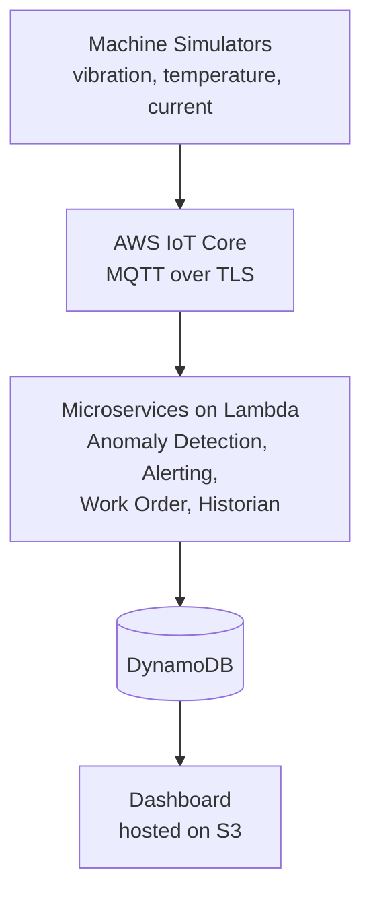

# SmartMaintaince

IoT enabled condition based maintenance system for a manufacturing site - Deakin unit project.

Voranda Galhenage (s225521044)

## What it does

Most factories either fix machines after they break or service them on a fixed schedule whether they need it or not. Both waste time and money. This project tries to catch problems early instead. Simulated machines constantly send vibration, temperature and current readings, and the system watches for readings that drift too far from normal. When that happens it raises an alert and creates a work order automatically, before the machine actually fails.

Everything is simulated, there is no real hardware. But it is built and deployed as a real event driven system on AWS so I could actually show it working and scaling, not just describe it on paper.

## Architecture



Simulators publish readings to IoT Core. IoT Core routes those readings to the Lambda functions. The anomaly detection function checks each reading against a rolling baseline and, if something looks wrong, publishes an event back onto IoT Core. The alerting, work order and historian functions all pick that event up independently and do their own job. Everything gets written to DynamoDB, and the dashboard just reads from there.

## Folders

```
sensor sim        the simulators, run these locally
lambda
  anomaly detection   baseline and z score logic
  alerting            sends SNS alerts, has a cooldown so it does not spam
  work order          same idea but creates a work order instead
  historian           logs everything for the record
  dashboard api        read only API the dashboard calls
dashboard
  index.html           the dashboard page, hosted on S3
```

## Running the simulator

```bash
cd sensor-sim
npm install
cp .env.example .env
npm start
```

You need to fill in your own IoT Core endpoint and certificate paths in `.env`. I did not commit my certificate files, anyone with them could publish fake data pretending to be one of my machines. Run it more than once with different MACHINE_ID values if you want more than one machine at a time.

## Deployed on AWS

The five Lambda functions are deployed individually and triggered by IoT Core rules, except the dashboard one which sits behind API Gateway. Table names and endpoints are passed in as environment variables instead of being hardcoded, so the same code works no matter which table it points at.

Data lives in five DynamoDB tables, Alerts, WorkOrders, Baselines, SensorReadings and EventLog. The dashboard is a plain HTML page on S3 that checks the API every 10 seconds.

## A few things I changed along the way

I originally planned two databases, DynamoDB for sensor data and a relational database for structured records. My tutor suggested simplifying that down to one database, so I moved to DynamoDB only. It ended up fitting the high write volume, low relational integrity story from my proposal even better than I expected.

I also planned a separate Node RED layer to filter and aggregate readings before anomaly detection. In the end I folded that logic straight into the anomaly detection Lambda instead. It does the same job with one less service to deploy and secure.

On the security side, TLS is enforced everywhere by default since IoT Core and API Gateway do not allow anything else. I looked into Secrets Manager but did not actually need it, nothing in this system uses a password or API key, it is all IAM roles and certificates. I thought about putting the Lambdas in a VPC too but decided against it. I did not want to spend AWS Academy lab credits on a NAT Gateway for something that does not really need network level segmentation when everything is already serverless and authenticated through IAM anyway.

## Testing

I ran a proper fault injection test, kept multiple simulators running for over 15 minutes with one of them pushed into a sustained fault state, and traced it end to end. Alerts landed in DynamoDB, real SNS emails arrived, work orders got created, and CloudWatch showed the Lambda invocation count actually climb during the fault window. There is also a small offline test script that mocks the AWS SDK so I could test the core logic, baseline building, anomaly flagging, cooldown behaviour, without needing a live AWS account every time.
